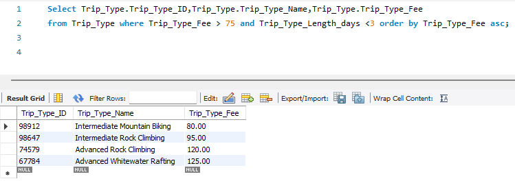
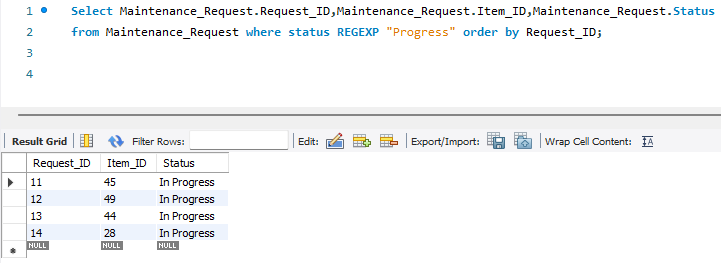
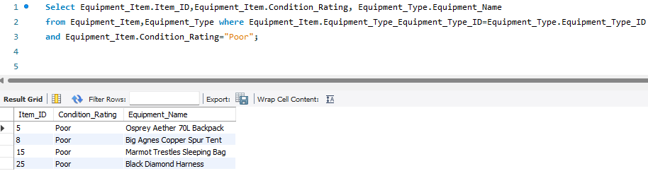
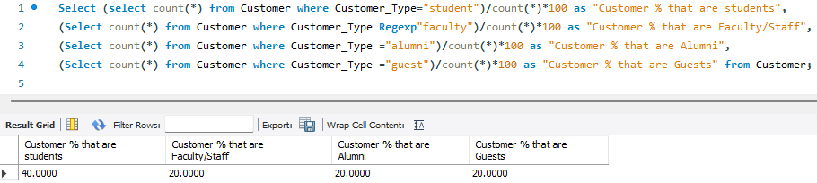
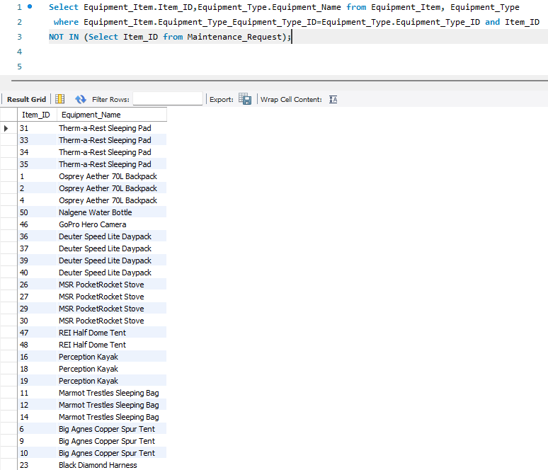
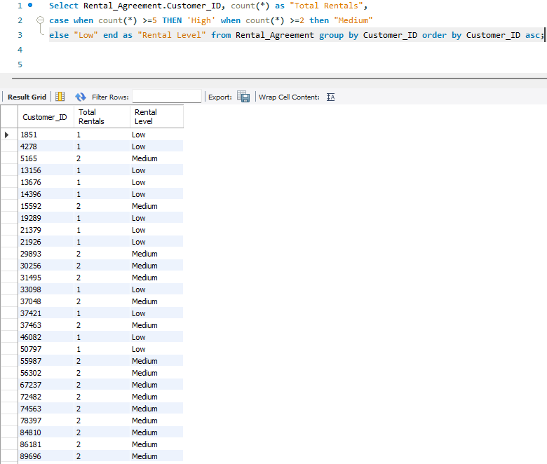
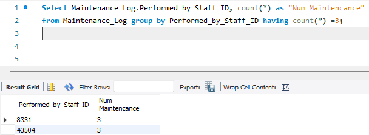
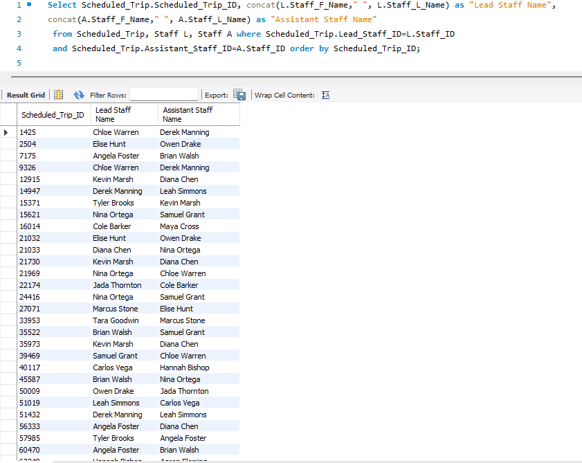
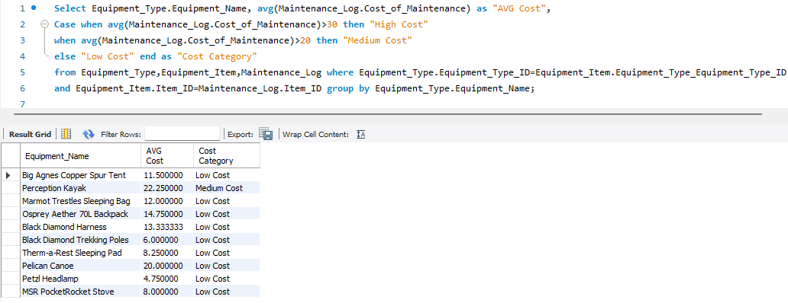

# Wilderness Exploration Society — Database Project

**MIST 4610 | Group Project | Case #1**  
University of Georgia — Terry College of Business | Spring 2026

---

## Table of Contents

1. [Project Overview](#project-overview)
2. [Team Members](#team-members)
3. [Data Model](#data-model)
4. [Data Model Description](#data-model-description)
5. [Data Dictionary](#data-dictionary)
6. [Sample Queries](#sample-queries)
7. [Database Setup Instructions](#database-setup-instructions)

---

## Project Overview

The Wilderness Exploration Society (WES) at Peachtree State University is an outdoor recreation organization that manages equipment rentals and trip registrations for university members (students, faculty/staff, and alumni) as well as sponsored guests. This project designs and implements a relational database to support WES operations, including:

- Customer and member/guest management with sponsor tracking
- Trip type definitions, prerequisite chains, and scheduling
- Trip registration with waiver and status tracking
- Equipment inventory management by type and individual item
- Rental agreement processing with per-item return date tracking
- Equipment maintenance requests, maintenance logs, and parts usage
- Supplier and parts inventory management
- Staff assignment to trips, rental agreements, and maintenance work

---

## Team Members

| Name | 
| [Haylesh Fernandez]
| [Italia Roman]
| [Zain Naseer]
| [Alden Majors]

---

## Data Model 

---

## Data Model Description

### Customers, Members & Guests
All people who interact with WES are stored in the `Customer` table (ID, first/last name, phone, date of birth, and customer type). University members have an associated `Member` record capturing their university role. Guests are tracked in a separate `Guest` table with a reference to their sponsoring `Customer`. A member can sponsor many guests, but each guest has exactly one sponsor.

### Trip Types & Prerequisites
WES offers named trip types stored in `Trip_Type`, each with a difficulty level, fee, and length in days. A self-referencing many-to-many bridge table — `Trip_Prerequisite` — captures which trip types must be completed before others can be attempted.

### Scheduled Trips & Registrations
Each trip type may be offered on multiple dates via `Scheduled_Trip`, which also designates a lead and assistant staff member. A unique constraint prevents the same trip type from being scheduled twice on the same date. `Registration` records each customer's enrollment, including waiver status (TINYINT: 1 = signed, 0 = not signed) and registration status (Confirmed, Waitlisted, or Cancelled). A unique constraint ensures at most one registration per customer per scheduled trip.

### Equipment Types & Items
Equipment is tracked at two levels: `Equipment_Type` defines the category with three tiered daily rates (student, faculty/alumni, guest), while `Equipment_Item` tracks each individual physical piece of gear with a unique auto-incremented ID and condition rating.

### Rental Agreements & Rental Items
When a customer rents equipment, a `Rental_Agreement` is created with a rental date and managing staff member. The bridge table `Rental_Agreement_has_Equipment_Item` links each agreement to one or more individual equipment items, recording expected and actual return dates per item.

### Maintenance Requests, Logs & Parts
Equipment issues are filed as `Maintenance_Request` records linked to a specific item and assigned staff member, with priority and status tracking. Work performed is logged in `Maintenance_Log` (date, description, outcome, cost, performing staff, and item). Parts consumed are recorded in `Maintenance_Part`, bridging a log entry to a `Part` and quantity used.

### Suppliers & Parts
`Supplier` stores vendor contact information. `Part` tracks individual parts with unit cost, stock quantity, and a link to the supplying vendor.

---

## Data Dictionary

### Table: `Customer`

| Column | Data Type | Constraints | Description |
|--------|-----------|-------------|-------------|
| `Customer_ID` | INT | PK, AUTO_INCREMENT | Unique identifier for each customer |
| `Customer_F_Name` | VARCHAR(15) | NOT NULL | Customer's first name |
| `Customer_L_Name` | VARCHAR(15) | NOT NULL | Customer's last name |
| `Customer_Phone` | VARCHAR(12) | | Customer's phone number |
| `Customer_DOB` | DATE | | Customer's date of birth |
| `Customer_Type` | VARCHAR(45) | NOT NULL | Student, Faculty/Staff, Alumni, or Guest |

---

### Table: `Member`

| Column | Data Type | Constraints | Description |
|--------|-----------|-------------|-------------|
| `Member_ID` | INT | PK, AUTO_INCREMENT | Unique identifier for the member record |
| `University_Role` | VARCHAR(90) | | Role at the university (e.g., Professor, Graduate Student) |
| `Customer_ID` | INT | FK → Customer(Customer_ID) | Links this member to a customer |

---

### Table: `Guest`

| Column | Data Type | Constraints | Description |
|--------|-----------|-------------|-------------|
| `Guest_ID` | INT | PK, AUTO_INCREMENT | Unique identifier for the guest record |
| `Customer_ID` | INT | FK → Customer(Customer_ID) | Links this guest to a customer |
| `Sponsor_ID` | INT | FK → Customer(Customer_ID) | The university member sponsoring this guest |

---

### Table: `Staff`

| Column | Data Type | Constraints | Description |
|--------|-----------|-------------|-------------|
| `Staff_ID` | INT | PK, AUTO_INCREMENT | Unique identifier for each staff member |
| `Staff_F_Name` | VARCHAR(15) | NOT NULL | Staff member's first name |
| `Staff_L_Name` | VARCHAR(15) | NOT NULL | Staff member's last name |
| `Staff_Phone` | VARCHAR(12) | | Staff member's phone number |

---

### Table: `Trip_Type`

| Column | Data Type | Constraints | Description |
|--------|-----------|-------------|-------------|
| `Trip_Type_ID` | INT | PK, AUTO_INCREMENT | Unique identifier for the trip type |
| `Trip_Type_Name` | VARCHAR(45) | NOT NULL | Descriptive name (e.g., "Beginner Kayaking") |
| `Trip_Type_Diff_Lvl` | VARCHAR(15) | NOT NULL | Difficulty level |
| `Trip_Type_Fee` | DECIMAL(5,2) | NOT NULL | Participation fee in dollars |
| `Trip_Type_Length_days` | INT | NOT NULL | Duration of the trip in days |

---

### Table: `Trip_Prerequisite`

| Column | Data Type | Constraints | Description |
|--------|-----------|-------------|-------------|
| `Trip_Type_ID` | INT | PK, FK → Trip_Type(Trip_Type_ID) | The trip that has a requirement |
| `Prerequisite_Trip_Type_ID` | INT | PK, FK → Trip_Type(Trip_Type_ID) | The trip that must be completed first |

> Composite primary key. Self-referencing many-to-many bridge on `Trip_Type`.

---

### Table: `Scheduled_Trip`

| Column | Data Type | Constraints | Description |
|--------|-----------|-------------|-------------|
| `Scheduled_Trip_ID` | INT | PK, AUTO_INCREMENT | Unique identifier for each scheduled occurrence |
| `Trip_Date` | DATE | NOT NULL | Date the trip is scheduled |
| `Lead_Staff_ID` | INT | FK → Staff(Staff_ID) | Staff member serving as lead |
| `Assistant_Staff_ID` | INT | FK → Staff(Staff_ID) | Staff member serving as assistant leader |
| `Trip_Type_ID` | INT | FK → Trip_Type(Trip_Type_ID) | The trip type being offered |

> Unique constraint on (`Trip_Type_ID`, `Trip_Date`) — a trip type cannot be scheduled more than once per date.

---

### Table: `Registration`

| Column | Data Type | Constraints | Description |
|--------|-----------|-------------|-------------|
| `Registration_ID` | INT | PK, AUTO_INCREMENT | Unique identifier for each registration |
| `Customer_ID` | INT | FK → Customer(Customer_ID) | The registering customer |
| `Scheduled_Trip_ID` | INT | FK → Scheduled_Trip(Scheduled_Trip_ID) | The scheduled trip being registered for |
| `Registration_Waiver` | TINYINT(1) | NOT NULL, DEFAULT 0 | 1 = waiver signed, 0 = not signed |
| `Registration_Status` | VARCHAR(10) | NOT NULL | Confirmed, Waitlisted, or Cancelled |

> Unique constraint on (`Customer_ID`, `Scheduled_Trip_ID`) — one registration per customer per trip.

---

### Table: `Equipment_Type`

| Column | Data Type | Constraints | Description |
|--------|-----------|-------------|-------------|
| `Equipment_Type_ID` | INT | PK, AUTO_INCREMENT | Unique identifier for the equipment type |
| `Equipment_Name` | VARCHAR(45) | NOT NULL | Descriptive name (e.g., "Osprey Aether 70L Backpack") |
| `Student_Rate` | DECIMAL(5,2) | NOT NULL | Daily rental rate for students |
| `Faculty_Alumni_Rate` | DECIMAL(5,2) | NOT NULL | Daily rental rate for faculty, staff, and alumni |
| `Guest_Rate` | DECIMAL(5,2) | NOT NULL | Daily rental rate for guests |

---

### Table: `Equipment_Item`

| Column | Data Type | Constraints | Description |
|--------|-----------|-------------|-------------|
| `Item_ID` | INT | PK, AUTO_INCREMENT | Unique identifier for each physical item |
| `Condition_Rating` | VARCHAR(4) | NOT NULL | Good, Fair, or Poor |
| `Equipment_Type_Equipment_Type_ID` | INT | FK → Equipment_Type(Equipment_Type_ID) | The type this item belongs to |

---

### Table: `Rental_Agreement`

| Column | Data Type | Constraints | Description |
|--------|-----------|-------------|-------------|
| `Agreement_ID` | INT | PK, AUTO_INCREMENT | Unique identifier for each rental agreement |
| `Rental_Date` | DATE | NOT NULL | Date the rental agreement was created |
| `Customer_ID` | INT | FK → Customer(Customer_ID) | Customer who is renting |
| `Staff_ID` | INT | FK → Staff(Staff_ID) | Staff member managing the agreement |

---

### Table: `Rental_Agreement_has_Equipment_Item`

| Column | Data Type | Constraints | Description |
|--------|-----------|-------------|-------------|
| `Rental_Agreement_Agreement_ID` | INT | PK, FK → Rental_Agreement(Agreement_ID) | The parent rental agreement |
| `Equipment_Item_Item_ID` | INT | PK, FK → Equipment_Item(Item_ID) | The specific physical item rented |
| `Expected_return_date` | VARCHAR(45) | | When the item is expected to be returned |
| `Actual_return_date` | VARCHAR(45) | | When the item was actually returned (NULL if still out) |

> Composite primary key on (`Rental_Agreement_Agreement_ID`, `Equipment_Item_Item_ID`).

---

### Table: `Maintenance_Request`

| Column | Data Type | Constraints | Description |
|--------|-----------|-------------|-------------|
| `Request_ID` | INT | PK, AUTO_INCREMENT | Unique identifier for the maintenance request |
| `Request_Date` | DATE | NOT NULL | Date the request was filed |
| `Issue_Description` | VARCHAR(90) | | Description of the equipment problem |
| `Priority` | VARCHAR(15) | | High, Medium, or Low |
| `Status` | VARCHAR(20) | | Open, In Progress, or Closed |
| `Item_ID` | INT | FK → Equipment_Item(Item_ID) | The item requiring maintenance |
| `Staff_ID` | INT | FK → Staff(Staff_ID) | Staff member assigned to the request |

---

### Table: `Maintenance_Log`

| Column | Data Type | Constraints | Description |
|--------|-----------|-------------|-------------|
| `Log_ID` | INT | PK, AUTO_INCREMENT | Unique identifier for the log entry |
| `Maintenance_Date` | DATE | NOT NULL | Date maintenance was performed |
| `Work_Done_Desc` | VARCHAR(90) | | Description of work performed |
| `Outcome` | VARCHAR(15) | | Resolved, Ongoing, etc. |
| `Maintenance_Count` | INT | | Number of maintenance events for this item |
| `Cost_of_Maintenance` | DECIMAL(5,2) | | Total cost of the work |
| `Maintenance_Request_ID` | INT | FK → Maintenance_Request(Request_ID) | The originating request |
| `Performed_by_Staff_ID` | INT | FK → Staff(Staff_ID) | Staff member who performed the work |
| `Item_ID` | INT | FK → Equipment_Item(Item_ID) | The item that was serviced |

---

### Table: `Maintenance_Part`

| Column | Data Type | Constraints | Description |
|--------|-----------|-------------|-------------|
| `Maintenance_Part_ID` | INT | PK, AUTO_INCREMENT | Unique identifier for this part-usage record |
| `Quantity_Used` | INT | NOT NULL | Number of parts consumed |
| `Maintenance_Log_ID` | INT | FK → Maintenance_Log(Log_ID) | The log entry where the part was used |
| `Part_ID` | INT | FK → Part(Part_ID) | The part that was consumed |

---

### Table: `Part`

| Column | Data Type | Constraints | Description |
|--------|-----------|-------------|-------------|
| `Part_ID` | INT | PK, AUTO_INCREMENT | Unique identifier for each part |
| `Part_Name` | VARCHAR(45) | NOT NULL | Name of the part |
| `Part_Unit_Cost` | DECIMAL(5,2) | NOT NULL | Cost per unit |
| `Part_Stock_Quantity` | INT | NOT NULL | Current quantity in stock |
| `Supplier_ID` | INT | FK → Supplier(Supplier_ID) | The supplier who provides this part |

---

### Table: `Supplier`

| Column | Data Type | Constraints | Description |
|--------|-----------|-------------|-------------|
| `Supplier_ID` | INT | PK, AUTO_INCREMENT | Unique identifier for the supplier |
| `Supplier_Name` | VARCHAR(50) | NOT NULL | Supplier's business name |
| `Supplier_Contact_F_name` | VARCHAR(45) | | Contact person's first name |
| `Supplier_Contact_L_name` | VARCHAR(45) | | Contact person's last name |
| `Supplier_Phone` | VARCHAR(45) | | Supplier's phone number |
| `Supplier_Email` | VARCHAR(30) | | Supplier's email address |
| `Supplier_Address` | VARCHAR(45) | | Supplier's mailing address |

---

## Queries
| Feature                     | Q1 | Q2 | Q3 | Q4 | Q5 | Q6 | Q7 | Q8 | Q9 | Q10 |
|----------------------------|----|----|----|----|----|----|----|----|----|-----|
| Multiple Table Join        |    |    |    | X  |    | X  |    |    | X  | X   |
| Subquery                   |    |    |    |    | X  | X  |    |    |    |     |
| GROUP BY                   |    |    |    |    |    |    | X  | X  |    | X   |
| GROUP BY with HAVING       |    |    |    |    |    |    |    | X  |    |     |
| Multi-condition WHERE      | X  |    |    | X  |    | X  |    |    |    |     |
| Built-in Functions         |    |    |    |    | X  |    | X  | X  | X  | X   |
| REGEXP                     |    | X  |    |    | X  |    |    |    |    |     |
| NOT EXISTS / NOT IN        |    |    |    |    |    | X  |    |    |    |     |
| ORDER BY                   | X  | X  | X  |    |    |    | X  |    | X  |     |

### Query 1 - 
Query 1 lists the trip type ID, trip name, and trip fee for all trips that cost more than $75 and than 3 days. The results are also ordered by trip fee in ascending order.

Query 1 allows WES managers to identify which trip types are short in duration but generate higher fees, making them attractive premium offerings. These trips are likely appealing to busy students, faculty, or guests with limited time, so WES can prioritize promoting and scheduling these trips more frequently to maximize revenue.

---

### Query 2 
Query 2 lists the request ID, item ID, and status for all maintenance requests whose status contains the word “Progress.” The results are also ordered by request ID.

Query 2 allows WES managers to see which equipment items are currently undergoing maintenance and are unavailable for rental. This helps ensure that enough equipment remains available for upcoming rentals and trips, while also allowing managers to monitor repair progress and avoid operational delays.

---

### Query 3 
 Query 3 lists the equipment type ID, equipment name, and guest rental rate for all equipment types with a guest rate greater than or equal to $5. The results are also ordered by guest rate in ascending order.

Query 3 allows WES managers to identify which equipment types have higher rental rates for guests, who are typically charged the most. These items likely generate greater revenue, so WES can prioritize maintaining and stocking these high-value items to increase profitability.

---

### Query 4 
Query 4 lists the item ID, condition rating, and equipment name for all equipment items that are in poor condition. This is done by joining the equipment item and equipment type tables.

Query 4 allows WES managers to quickly identify equipment items that are in poor condition and may need repair or replacement. Since unsafe or damaged equipment can negatively impact trip experiences and safety, this query helps managers prioritize maintenance and ensure all gear meets quality standards.

---

### Query 5 
Query 5 lists the percentage of customers who are students, faculty/staff, alumni, and guests out of the total number of customers. These percentages are calculated using subqueries.

Query 5 allows WES managers to understand the distribution of customers across different groups such as students, faculty/staff, alumni, and guests. This helps WES tailor pricing, marketing strategies, and trip offerings toward their largest customer segments to better meet demand.

---

### Query 6 
Query 6 lists the item ID and equipment name for all equipment items that do not appear in any maintenance request. This is done using a subquery to exclude items with maintenance records.

Query 6 allows WES managers to identify equipment that has never required maintenance, which may indicate either high reliability or a lack of inspection. This helps managers ensure that all equipment is being properly monitored and maintained to prevent unexpected failures during rentals or trips.

---

### Query 7 
Query 7 lists each customer ID along with their total number of rentals and assigns a rental level of High, Medium, or Low based on that total. The results are grouped by customer ID and ordered in ascending order.

Query 7 allows WES managers to categorize customers based on how frequently they rent equipment, identifying high, medium, and low activity users. This helps managers target frequent renters with loyalty incentives while also encouraging less active customers to increase participation.

---

### Query 8 
Query 8 lists the staff ID of employees along with the number of maintenance tasks they have performed, but only includes those who have completed exactly three tasks. The results are grouped by staff ID.

Query 8 allows WES managers to identify staff members who have completed exactly three maintenance tasks, providing insight into workload distribution. This helps ensure maintenance responsibilities are balanced and allows managers to adjust staffing if certain employees are under- or over-utilized.

---

### Query 9 
Query 9 lists each scheduled trip ID along with the full names of the lead and assistant staff members assigned to the trip. The results are also ordered by scheduled trip ID.

Query 9 allows WES managers to clearly see which staff members are assigned as lead and assistant leaders for each scheduled trip. This ensures that every trip is properly staffed and helps managers coordinate scheduling, accountability, and communication among staff.

---

### Query 10 
Query 10 lists each equipment type along with the average cost of maintenance and categorizes each as High Cost,  Medium Cost, or Low Cost. The results are grouped by equipment name.

Query 10 allows WES managers to evaluate which types of equipment have higher average maintenance costs and categorize them accordingly. This helps managers make informed decisions about whether to continue maintaining certain equipment, adjust rental pricing, or invest in replacements to reduce long-term costs.
